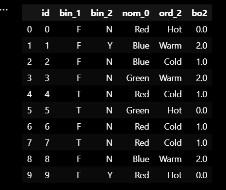

## EXNO-3-DS

# AIM:
To read the given data and perform Feature Encoding and Transformation process and save the data to a file.

# ALGORITHM:
STEP 1:Read the given Data.
STEP 2:Clean the Data Set using Data Cleaning Process.
STEP 3:Apply Feature Encoding for the feature in the data set.
STEP 4:Apply Feature Transformation for the feature in the data set.
STEP 5:Save the data to the file.

# FEATURE ENCODING:
1. Ordinal Encoding
An ordinal encoding involves mapping each unique label to an integer value. This type of encoding is really only appropriate if there is a known relationship between the categories. This relationship does exist for some of the variables in our dataset, and ideally, this should be harnessed when preparing the data.
2. Label Encoding
Label encoding is a simple and straight forward approach. This converts each value in a categorical column into a numerical value. Each value in a categorical column is called Label.
3. Binary Encoding
Binary encoding converts a category into binary digits. Each binary digit creates one feature column. If there are n unique categories, then binary encoding results in the only log(base 2)ⁿ features.
4. One Hot Encoding
We use this categorical data encoding technique when the features are nominal(do not have any order). In one hot encoding, for each level of a categorical feature, we create a new variable. Each category is mapped with a binary variable containing either 0 or 1. Here, 0 represents the absence, and 1 represents the presence of that category.

# Methods Used for Data Transformation:
  # 1. FUNCTION TRANSFORMATION
• Log Transformation
• Reciprocal Transformation
• Square Root Transformation
• Square Transformation
  # 2. POWER TRANSFORMATION
• Boxcox method
• Yeojohnson method

# CODING AND OUTPUT:
```py
import pandas as pd
df=pd.read_csv("Encoding Data.csv")
df
```


```py
from sklearn.preprocessing import LabelEncoder,OrdinalEncoder
pm=['Hot','Warm','Cold']
e1=OrdinalEncoder(categories=[pm])
e1.fit_transform(df[["ord_2"]])
```


```py
df['bo2']=e1.fit_transform(df[["ord_2"]])
df
```


```py
le=LabelEncoder()
dfc=df.copy()
dfc['ord_2']=le.fit_transform(dfc['ord_2'])
dfc
```


```py
from sklearn.preprocessing import OneHotEncoder
ohe=OneHotEncoder(sparse=False)
df2=df.copy()
enc=pd.DataFrame(ohe.fit_transform(df2[["nom_0"]]))
```


```py
df2=pd.concat([df2,enc],axis=1)
df2
```


```py
pd.get_dummies(df2,columns=["nom_0"])
```


```py
pip install --upgrade category_encoders
```


```py
from category_encoders import BinaryEncoder
df=pd.read_csv("/content/data.csv")
df
```


```py
be=BinaryEncoder()
nd=be.fit_transform(df['Ord_2'])
df
```


```py
dfb=pd.concat([df,nd],axis=1)
dfb
```


```py
from category_encoders import TargetEncoder
te=TargetEncoder()
CC=df.copy()
new=te.fit_transform(X=CC["City"],y=CC["Target"])
CC=pd.concat([CC,new],axis=1)
CC
```


```py
import pandas as pd
from scipy import stats
import numpy as np
df=pd.read_csv("/content/Data_to_Transform.csv")
df
```


```py
df.skew()
```


```py
np.log(df["Highly Positive Skew"])
```


```py
np.reciprocal(df["Moderate Positive Skew"])
```


```py
np.sqrt(df["Highly Positive Skew"])
```


```py
np.square(df["Highly Positive Skew"])
```


```py
df["Highly Positive Skew_boxcox"], parameters=stats.boxcox(df["Highly Positive Skew"])
df
```


```py
df.skew()
```


```py
df["Highly Negative Skew_yeojohnson"],parameters=stats.yeojohnson(df["Highly Negative Skew"])
```


```py
import seaborn as sns
import statsmodels.api as sm
import matplotlib.pyplot as plt
sm.qqplot(df["Moderate Negative Skew"],line='45')
plt.show()
```


```py
sm.qqplot(np.reciprocal(df["Moderate Negative Skew"]),line='45')
plt.show()
```


```py
from sklearn.preprocessing import QuantileTransformer
qt=QuantileTransformer(output_distribution='normal',n_quantiles=891)

df["Moderate Negative Skew"]=qt.fit_transform(df[["Moderate Negative Skew"]])

sm.qqplot(df["Moderate Negative Skew"],line='45')
plt.show()
```


```py
df["Highly Negative Skew_1"]=qt.fit_transform(df[["Highly Negative Skew"]])
sm.qqplot(df["Highly Negative Skew"],line='45')
plt.show()
```


```py
sm.qqplot(df["Highly Negative Skew_1"],line='45')
plt.show()
```


# RESULT:
 Thus the given data, Feature Encoding, Transformation process and save the data to a file was performed successfully.
       
